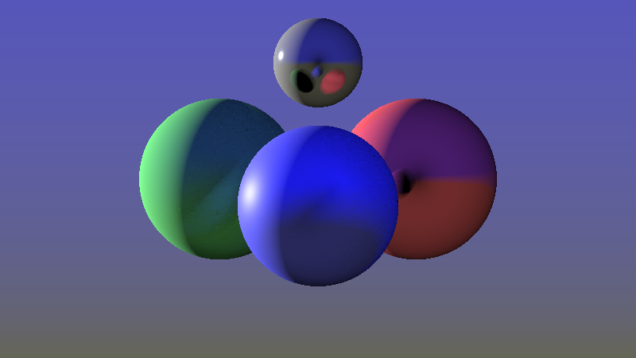

# PathTracing-Notes
Brief notes of Monte Carlo path tracing, explaining the math behind it in order to implement it in any programming language.

[Take a look at the math behind](Path_Tracing_Notes.pdf)

Ray tracing and Monte Carlo Global Illumination, with PBR materials, HDR and gamma correction.
